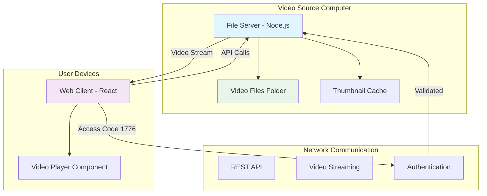

# Video Streaming Web App - Comprehensive Plan

## Project Overview

A two-component video streaming application consisting of:
1. **File Server** (Node.js) - Runs on the computer with videos
2. **Web Client** (React) - Accessed by users to browse and watch videos

### Key Requirements
- Source videos from a specified folder on a remote computer
- Default access code: 1776
- Netflix-style interface with video thumbnails
- Advanced video player with quality selection, speed controls, and fullscreen
- Support for MP4 format with comprehensive controls
- Search functionality and category organization

## System Architecture



## Component Details

### 1. File Server (Node.js Backend)

**Technology Stack:**
- Node.js with Express.js
- FFmpeg for video processing and thumbnail generation
- Multer for file handling
- CORS for cross-origin requests
- JWT for session management

**Key Features:**
- Video file discovery and indexing
- Thumbnail generation and caching
- Video metadata extraction (duration, resolution, etc.)
- Video streaming with range requests
- Access code authentication (1776)
- RESTful API endpoints

**API Endpoints:**
```
POST /auth/login          - Authenticate with access code
GET /api/videos           - List all videos with metadata
GET /api/videos/:id       - Get specific video details
GET /api/thumbnails/:id   - Serve video thumbnails
GET /api/stream/:id       - Stream video content
GET /api/search           - Search videos by title/metadata
```

**File Structure:**
```
file-server/
├── src/
│   ├── controllers/
│   │   ├── authController.js
│   │   ├── videoController.js
│   │   └── streamController.js
│   ├── middleware/
│   │   ├── auth.js
│   │   └── cors.js
│   ├── routes/
│   │   ├── auth.js
│   │   ├── videos.js
│   │   └── stream.js
│   ├── services/
│   │   ├── videoService.js
│   │   ├── thumbnailService.js
│   │   └── metadataService.js
│   └── utils/
│       ├── ffmpeg.js
│       └── fileScanner.js
├── thumbnails/
├── config/
│   └── config.json
├── package.json
└── server.js
```

### 2. Web Client (React Frontend)

**Technology Stack:**
- React 18 with functional components
- React Router for navigation
- Axios for API communication
- Video.js or custom HTML5 player for advanced controls
- CSS Grid/Flexbox for Netflix-style layout
- React Context for state management

**Key Components:**
- Authentication component (access code input)
- Video grid/library component
- Search and filter component
- Video player with advanced controls
- Category/genre navigation
- Responsive design for mobile/desktop

**File Structure:**
```
web-client/
├── src/
│   ├── components/
│   │   ├── Auth/
│   │   │   └── LoginForm.jsx
│   │   ├── VideoGrid/
│   │   │   ├── VideoGrid.jsx
│   │   │   └── VideoCard.jsx
│   │   ├── VideoPlayer/
│   │   │   ├── VideoPlayer.jsx
│   │   │   └── PlayerControls.jsx
│   │   ├── Search/
│   │   │   └── SearchBar.jsx
│   │   └── Layout/
│   │       ├── Header.jsx
│   │       └── Navigation.jsx
│   ├── pages/
│   │   ├── Home.jsx
│   │   ├── VideoDetail.jsx
│   │   └── Login.jsx
│   ├── services/
│   │   ├── api.js
│   │   └── auth.js
│   ├── hooks/
│   │   ├── useAuth.js
│   │   └── useVideos.js
│   ├── context/
│   │   └── AuthContext.js
│   └── styles/
│       ├── global.css
│       └── components/
├── public/
│   └── index.html
└── package.json
```

### 3. Advanced Video Player Features

**Custom Video Player with:**
- Quality selection (if multiple resolutions available)
- Playback speed controls (0.5x, 1x, 1.25x, 1.5x, 2x)
- Fullscreen mode
- Keyboard shortcuts (Space: play/pause, Arrow keys: seek, F: fullscreen)
- Progress bar with thumbnail previews
- Volume control with mute
- Auto-play next video option
- Picture-in-picture mode

### 4. Netflix-Style UI Design

**Layout Features:**
- Hero banner with featured video
- Horizontal scrolling rows by category
- Grid view with hover effects showing video info
- Search bar with real-time filtering
- Responsive thumbnail grid (adapts to screen size)
- Dark theme with modern styling
- Loading states and error handling
- Smooth animations and transitions

**UI Components:**
- Video cards with hover effects
- Category sections
- Search and filter controls
- Responsive navigation
- Loading spinners
- Error boundaries

## Implementation Plan

### Phase 1: File Server Development
1. **Project Setup**
   - Initialize Node.js project with Express
   - Set up project structure and dependencies
   - Configure development environment

2. **Core Services**
   - Implement video file scanning and indexing
   - Create thumbnail generation using FFmpeg
   - Build metadata extraction service
   - Set up file caching system

3. **Authentication & API**
   - Build authentication system with access code 1776
   - Develop RESTful API endpoints
   - Implement JWT session management
   - Add CORS configuration

4. **Video Streaming**
   - Develop video streaming endpoints with range support
   - Optimize streaming performance
   - Add error handling and logging

### Phase 2: Web Client Development
1. **Project Setup**
   - Initialize React project with Create React App
   - Set up routing with React Router
   - Configure development environment

2. **Authentication Flow**
   - Create login component with access code input
   - Implement authentication context
   - Add protected routes

3. **Video Library Interface**
   - Build video grid component with Netflix-style layout
   - Create video card components with thumbnails
   - Implement responsive design

4. **Search & Navigation**
   - Develop search functionality with real-time filtering
   - Add category navigation
   - Implement sorting and filtering options

5. **Video Player**
   - Create custom video player component
   - Add advanced controls (quality, speed, fullscreen)
   - Implement keyboard shortcuts
   - Add progress tracking

### Phase 3: Integration & Testing
1. **API Integration**
   - Connect frontend to backend APIs
   - Implement error handling and loading states
   - Add retry logic for failed requests

2. **Performance Optimization**
   - Test video streaming performance
   - Optimize thumbnail loading with lazy loading
   - Implement client-side caching
   - Add progressive loading

3. **Cross-Platform Testing**
   - Test across different devices and browsers
   - Verify responsive design
   - Test video playback compatibility

### Phase 4: Deployment & Configuration
1. **Configuration Management**
   - Create configuration files for both apps
   - Add environment-specific settings
   - Implement logging and monitoring

2. **Documentation**
   - Add installation and setup documentation
   - Create user guides
   - Document API endpoints

3. **Network Setup**
   - Test network connectivity between components
   - Configure firewall and port settings
   - Add network troubleshooting guide

## Technical Specifications

### Video Format Support
- **Primary Format:** MP4 (H.264 video, AAC audio)
- **Thumbnail Format:** JPEG (generated from video frames)
- **Streaming:** HTTP range requests for efficient streaming
- **Quality Detection:** Automatic resolution detection via FFmpeg

### Network Configuration
- **File Server Port:** 3001 (configurable)
- **Web Client Port:** 3000 (configurable)
- **Network Access:** Local network or internet (configurable)
- **CORS:** Configured for cross-origin requests

### Security Considerations
- Access code validation (1776)
- JWT token-based session management
- CORS configuration for specific origins
- Rate limiting on API endpoints
- Input validation and sanitization
- Secure video streaming without exposing file paths
- No direct file system access from client

### Performance Optimizations
- **Server Side:**
  - Video thumbnail caching
  - Metadata caching in memory
  - Efficient file scanning with change detection
  - Range request support for video streaming
  - Gzip compression for API responses

- **Client Side:**
  - Lazy loading for video grid
  - Progressive video loading
  - Client-side caching of metadata
  - Debounced search queries
  - Virtual scrolling for large video lists

## Development vs Production Setup

### Development Environment
- Both apps run locally for testing
- File server points to local video folder
- Hot reloading enabled for both applications
- Debug logging enabled

### Production Environment
- File server deployed on video source computer
- Web client can be hosted anywhere or run locally on user devices
- Production logging and error handling
- Optimized builds with minification

## Configuration Files

### File Server Configuration (config/config.json)
```json
{
  "port": 3001,
  "videoFolder": "C:/Videos",
  "thumbnailFolder": "./thumbnails",
  "accessCode": "1776",
  "jwtSecret": "your-secret-key",
  "corsOrigins": ["http://localhost:3000"],
  "maxThumbnailAge": 86400000,
  "supportedFormats": [".mp4", ".avi", ".mkv", ".mov"]
}
```

### Web Client Configuration (.env)
```
REACT_APP_API_BASE_URL=http://localhost:3001
REACT_APP_DEFAULT_ACCESS_CODE=1776
REACT_APP_VIDEO_GRID_COLUMNS=4
REACT_APP_THUMBNAIL_QUALITY=medium
```

## Future Enhancement Possibilities
- User accounts and personalized recommendations
- Video ratings and reviews
- Playlist creation and management
- Subtitle support
- Multiple video quality transcoding
- Mobile app development
- Chromecast/AirPlay support
- Video upload functionality
- Advanced search with filters (genre, year, duration)
- Watch history and resume playback

---

This comprehensive plan provides a robust foundation for building a professional-grade video streaming application with modern UI/UX and advanced features.